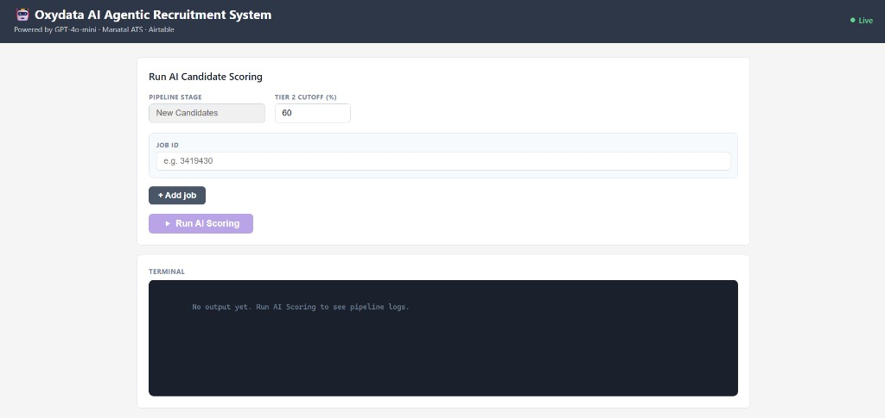
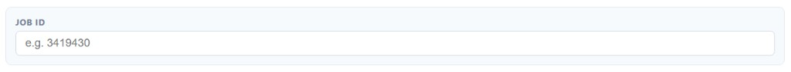
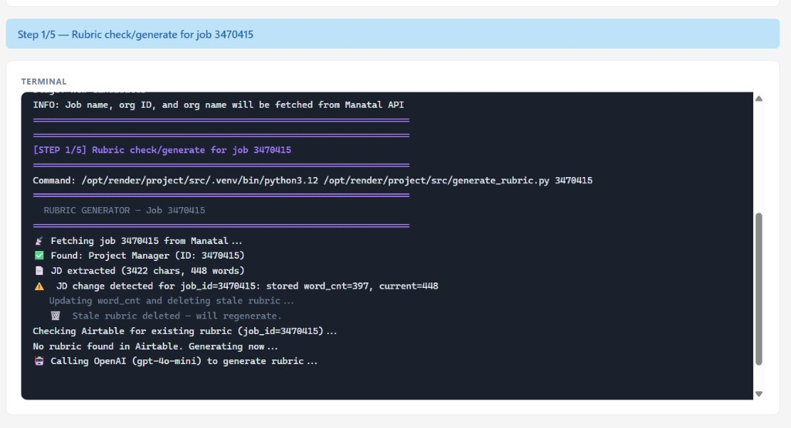
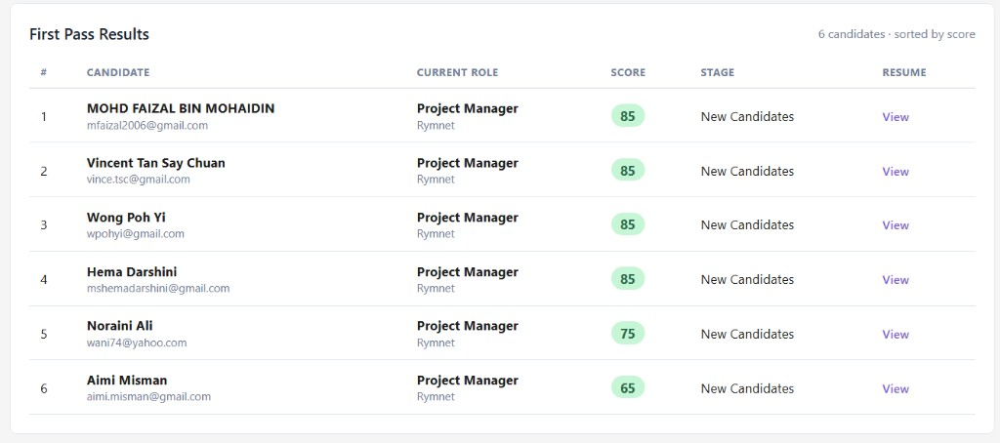
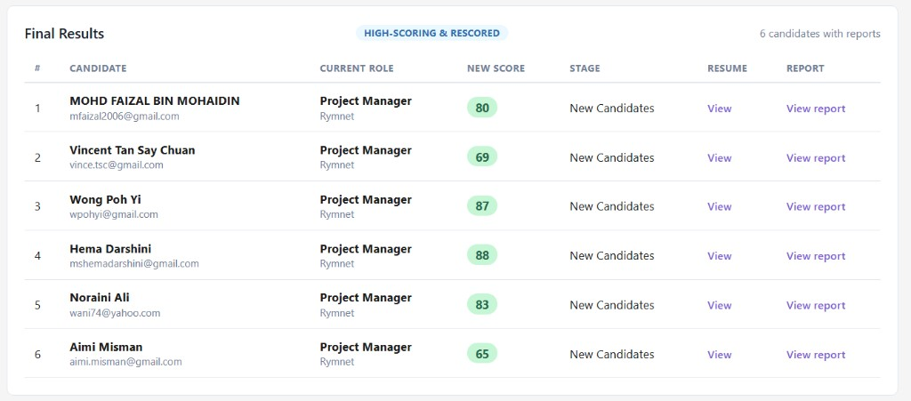
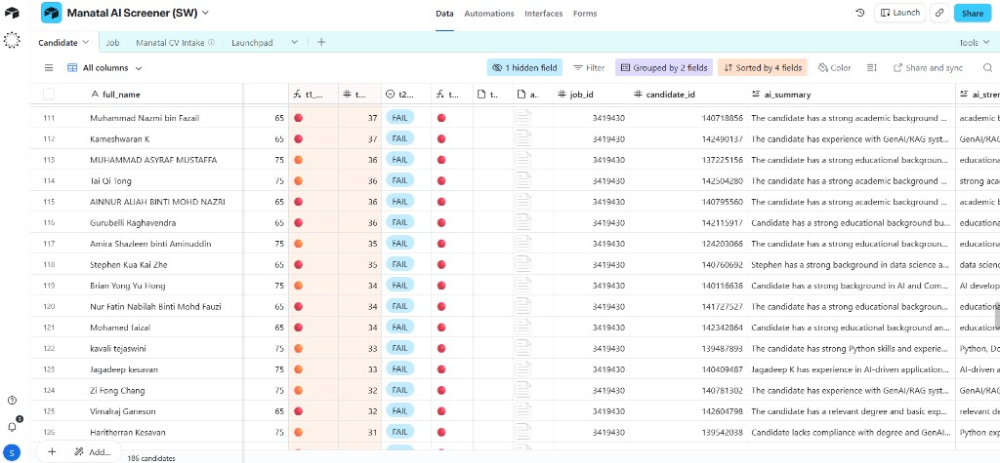

# Oxydata AI Recruitment Pipeline

**Standard Operating Procedure (SOP) for end-to-end AI candidate scoring**

Generated on 25 Mar 2026

---

## Cover and Purpose

The Oxydata AI Agentic Recruitment System helps recruiters screen and score candidates against job requirements using AI. It connects to your Manatal ATS, runs a multi-tier scoring pipeline powered by GPT, and stores all results in Airtable — so you get scored candidates, detailed reports, and automatic ATS stage updates from a single button click.

This guide is written for recruiters and TA users who want a repeatable, low-friction workflow for AI-powered candidate screening.

By the end of each run, you should have:

- A ranked list of candidates with Tier 1 (first-pass) AI scores, summaries, strengths, and gaps
- Detailed Tier 2 AI reports for high-scoring candidates
- Candidates automatically moved to the correct stage in Manatal (passing to "AI Screened", failing to the fail stage)
- All scores, reports, and status fields synced to Airtable

---

## System Overview

The dashboard is a single-page web application with the following layout:

**Header** — Displays the system name, subtitle (Powered by GPT-4o-mini, Manatal ATS, Airtable), and a Live/Offline indicator showing whether the server is reachable.

**Run AI Candidate Scoring card** — The main control area where you enter job IDs and start a run. Contains:

- **Pipeline Stage** — Pre-set to "New Candidates" (read-only). This is the Manatal stage the system pulls candidates from.
- **Tier 2 Cutoff (%)** — The minimum Tier 1 score a candidate needs to receive a detailed Tier 2 report. Pre-filled from the server default (typically 60). You can adjust this per run if needed.
- **Job ID rows** — One or more text fields where you enter Manatal job IDs. Use "+ Add job" to add more rows, and "Remove" to delete extras.
- **Run AI Scoring button** — Starts the pipeline. Disabled while a run is in progress or if no job IDs are entered.

**Status bar** — Appears below the controls once a run starts. Shows the current pipeline step in plain language (e.g., "Step 2/4 — AI Scoring", "Found 12 candidates — running Tier 1 scoring…"). Color-coded: blue while running, green on success, red on failure.

**Terminal** — A dark log panel that streams real-time output from the pipeline. Log lines are color-coded: purple for step headers, green for success, orange for warnings, red for errors, and blue for informational messages.

**First Pass Results (Tier 1)** — A table that appears after the run completes, showing all scored candidates ranked by score.

**Final Results (Tier 2)** — A table that appears below the first-pass results, showing only high-scoring candidates that received detailed AI reports.

---

## Primary SOP (Step-by-step)

### Step 1: Enter Job IDs and Settings

1. Open the Oxydata dashboard in your browser.
2. In the **Job ID** field, type the Manatal job ID you want to screen (e.g., `3419430`).
3. To screen multiple jobs in one run, click **+ Add job** and enter additional job IDs.
4. Check the **Tier 2 Cutoff (%)**. The default value is loaded from the server. Leave it as-is unless you have a reason to raise or lower the threshold for this run.

**What success looks like:**

- One or more job IDs are entered in the input fields
- The **Run AI Scoring** button is active (not greyed out)
- The Live indicator in the header shows "Live"

---

### Step 2: Run AI Scoring

5. Click **Run AI Scoring**.
6. Watch the **status bar** for high-level progress updates. It will cycle through messages like:
   - "Step 1/5 — Rubric check/generate for job 3470415"
   - "Found 15 candidate(s) — running Tier 1 scoring…"
   - "Generating Tier 2 reports…"
   - "Done. Results loaded below."
7. The **terminal** shows detailed log output in real time. You do not need to read every line — the status bar summarizes it for you.

**What happens behind the scenes (you do not need to do anything):**

- The system generates or validates a scoring rubric from the job description
- Each candidate's resume is scored against the rubric (Tier 1)
- Candidates above the cutoff receive a detailed AI analysis (Tier 2)
- Results are uploaded to Airtable
- Candidates are moved to the appropriate stage in Manatal

**What success looks like:**

- The status bar turns green and reads "Done. Results loaded below."
- The terminal shows completion messages without red error lines
- The First Pass Results table appears below the terminal

---

### Step 3: Review First Pass Results (Tier 1)

8. Scroll down to the **First Pass Results** section.
9. Review the candidate table. Each row shows:

| Column | What it means |
|---|---|
| **#** | Rank by score (highest first) |
| **Candidate** | Full name and email |
| **Current Role** | Most recent job title and organization |
| **Score** | Tier 1 AI score as a color-coded badge: green (above cutoff), orange (close), red (below), grey (no score) |
| **Stage** | Current Manatal pipeline stage |
| **Resume** | "View" link to open the candidate's CV |

10. Click any candidate row to expand it. The expanded view shows three detail cards:
    - **Summary** — A brief AI-generated overview of the candidate's fit
    - **Strengths** — What the AI identified as strong matches to the rubric
    - **Gaps** — Where the candidate falls short of the requirements

**What success looks like:**

- Candidates are listed and ranked by score
- Score badges are color-coded (green for passing, red for failing)
- Expanding a row shows meaningful summary, strengths, and gaps text

---

### Step 4: Review Final Results (Tier 2)

11. Scroll down to the **Final Results** section (appears below First Pass Results).
12. This table contains only candidates whose Tier 1 score met or exceeded the Tier 2 Cutoff. These candidates received a deeper AI analysis.
13. Each row shows:

| Column | What it means |
|---|---|
| **#** | Rank by refined score |
| **Candidate** | Full name and email |
| **Current Role** | Most recent job title and organization |
| **New Score** | The Tier 2 refined score (may differ from the Tier 1 score) |
| **Stage** | Current Manatal pipeline stage |
| **Resume** | "View" link to the CV |
| **Report** | "View report" link to the full AI-generated candidate report |

14. Click **View report** to open a detailed HTML report for any candidate. This report contains an in-depth rubric-based evaluation, section-by-section scoring, and a recommendation.

**What success looks like:**

- The Final Results section appears with a badge reading "HIGH-SCORING & RESCORED"
- Each qualifying candidate has a "View report" link
- Clicking the link opens a formatted report in a new tab

---

### Step 5: Review Results in Airtable

15. Open your Airtable base and navigate to the **Candidates** table.
16. All candidates from the run are synced here. Key fields to review:

| Airtable Field | What it contains |
|---|---|
| **full_name** | Candidate's full name |
| **match_id** | Manatal match identifier |
| **job_id** | The job this candidate was scored against |
| **t1_score** | Tier 1 AI score (0–100) |
| **t1_status** | PASS or FAIL based on the cutoff |
| **ai_summary** | AI-generated one-line summary |
| **ai_strengths** | Key strengths identified by the AI |
| **ai_gaps** | Key gaps or missing qualifications |
| **t2_score** | Tier 2 refined score (only for candidates above the cutoff) |
| **t2_status** | Tier 2 PASS or FAIL |
| **ai_report_html** | Attachment containing the full detailed HTML report |
| **cache_key** | Internal identifier — if a rubric changes, this updates and reports regenerate on the next run |

17. Use Airtable's built-in filtering and sorting to create views that suit your workflow (e.g., filter by `t1_status = PASS`, sort by `t2_score` descending).

**What success looks like:**

- Candidate rows exist for each person the pipeline processed
- `t1_score` fields are populated with numeric scores
- High-scoring candidates have `t2_score` and `ai_report_html` filled in
- The `job_id` field links to the correct job record

---

### Step 6: Check Manatal ATS Stage Updates

18. Open Manatal and navigate to the job you just scored.
19. Verify that candidates have been moved to the correct stages:
    - **Passing candidates** (score at or above the cutoff) should now be in the **"AI Screened"** stage
    - **Failing candidates** (score below the cutoff) should now be in the designated fail stage
20. If any candidates were not moved (e.g., due to a network issue during the run), the terminal log will contain `[WARN]` lines identifying them. You can move these candidates manually in Manatal or re-run the pipeline.

**What success looks like:**

- Passing candidates appear in the "AI Screened" stage in Manatal
- Failing candidates appear in the fail stage
- No candidates are stuck in the original "New Candidates" stage (unless they were added after the run started)

---

## Multi-Job Runs

You can screen candidates for multiple jobs in a single run.

1. Enter the first job ID in the default field.
2. Click **+ Add job** to add a second (or third, fourth, etc.) job ID row.
3. Click **Run AI Scoring** — the pipeline processes each job sequentially.

**What to know:**

- The status bar and terminal update as each job is processed. You will see messages like "Processing job 3419430 (1 of 2)…" followed by "Processing job 3261113 (2 of 2)…".
- If one job fails (e.g., invalid job ID, no candidates found), the pipeline continues with the remaining jobs. The terminal will show an error for the failed job, and the status bar will report "Pipeline finished with errors" at the end.
- The **First Pass Results** and **Final Results** tables in the dashboard display results for the first successfully loaded job. All jobs' results are still synced to Airtable regardless of which one the dashboard displays.
- To remove a job ID row before running, click the **Remove** button next to it (visible when more than one row exists).

---

## Output and Field Reference

### Dashboard Results

**First Pass Results table:**

| Column | Source | Description |
|---|---|---|
| # | Computed | Rank position (1 = highest score) |
| Candidate | Airtable `full_name`, `email` | Name and email address |
| Current Role | Airtable `job_name`, `org_name` | Most recent role and organization |
| Score | Airtable `t1_score` | Tier 1 AI score (0–100), color-coded |
| Stage | Airtable `match_stage_name` | Current Manatal pipeline stage |
| Resume | Airtable `cv_url` | Link to the candidate's CV file |

**Final Results table:**

| Column | Source | Description |
|---|---|---|
| # | Computed | Rank position |
| Candidate | Airtable `full_name`, `email` | Name and email address |
| Current Role | Airtable `job_name`, `org_name` | Most recent role and organization |
| New Score | Airtable `t2_score` (fallback: `t1_score`) | Tier 2 refined score, or Tier 1 if Tier 2 not yet available |
| Stage | Airtable `match_stage_name` | Current Manatal pipeline stage |
| Resume | Airtable `cv_url` | Link to the CV |
| Report | Airtable `ai_report_html` | Link to the full Tier 2 AI report |

### Score Badge Colors

| Color | Meaning |
|---|---|
| Green | Score is at or above the Tier 2 Cutoff |
| Orange | Score is close to the cutoff (within 70% of the threshold) |
| Red | Score is well below the cutoff |
| Grey | No score available |

### What a Tier 2 Report Contains

The detailed AI report for each qualifying candidate includes:

- A rubric-based evaluation covering each requirement area
- Section-by-section scoring against the job's criteria
- A strengths and gaps analysis with more depth than the Tier 1 summary
- An overall recommendation (PASS or FAIL with reasoning)

---

## Troubleshooting

### Pipeline fails mid-run

- Check the **terminal** for red error lines. Common causes include network timeouts to Manatal or OpenAI, or an invalid API token.
- If one job in a multi-job run fails, the remaining jobs still complete. Look for "Continuing with next job…" in the terminal.
- Try running the failed job again on its own. Transient network issues often resolve on a retry.
- If the status bar reads "Connection lost. Check server logs," the server may have gone offline. Refresh the page and check that the Live indicator returns before re-running.

### No candidates found for a job ID

- Verify the job ID is correct in Manatal.
- Check that candidates exist in the **"New Candidates"** stage for that job. The pipeline only pulls candidates from this specific stage.
- If candidates were already screened in a previous run, they may have been moved to "AI Screened" or the fail stage. They will not appear again unless moved back to "New Candidates."

### Scores are missing or zero

- A score of **0** typically means the candidate had no resume attached in Manatal. Check the terminal for `[no resume]` warnings.
- If scores are missing entirely in Airtable, the upload step may have failed. Look for `[WARN]` or `[ERROR]` lines in the terminal related to Airtable uploads.
- If a rubric was regenerated during the run (you will see "Rubric was regenerated" in the terminal), all existing candidates for that job are rescored automatically.

### Stale browser or cached results

- Hard-refresh the page (Ctrl+Shift+R on Windows, Cmd+Shift+R on macOS).
- If the dashboard still shows old data, the server may need to be restarted. Contact your admin.
- Results in Airtable are always the most current source of truth — check there if the dashboard seems stale.

---

## Best Practices

- **Verify the job ID before running.** A wrong job ID will either fail or score candidates for the wrong role.
- **Leave the Tier 2 Cutoff at the default unless you have a reason.** Raising it means fewer candidates get detailed reports; lowering it means more candidates are analyzed in depth, which takes longer and uses more API credits.
- **Review both Tier 1 and Tier 2 results.** Tier 1 is a fast screen — it catches obvious mismatches. Tier 2 provides the nuanced analysis you need for shortlisting.
- **Expand candidate rows in First Pass Results.** The summary, strengths, and gaps give you quick talking points without needing to open the full report.
- **Use Airtable for your working view.** The dashboard is optimized for running the pipeline and doing a first review. For ongoing candidate management, filtering, and sharing, Airtable gives you more flexibility.
- **Check Manatal after each run.** Confirm candidates landed in the correct stages. If any were flagged with warnings in the terminal, handle them manually.
- **Re-run when the job description changes.** If the hiring manager updates the JD, running the pipeline again will regenerate the rubric and rescore all candidates. The system detects JD changes automatically.
- **Run single-job for urgent roles, multi-job for batch processing.** Single-job runs complete faster and let you review results immediately. Multi-job runs are efficient for processing a backlog.

---

## Day-to-Day Checklist

- [ ] Open the Oxydata dashboard and confirm the server is Live
- [ ] Enter the Manatal job ID(s) to screen
- [ ] Click **Run AI Scoring** and monitor the status bar
- [ ] Review the **First Pass Results** — check scores, expand key candidates
- [ ] Review the **Final Results** — open Tier 2 reports for top candidates
- [ ] Open **Airtable** — verify scores, reports, and status fields are populated
- [ ] Open **Manatal** — confirm candidates moved to the correct stages
- [ ] Take action on top candidates (shortlist, schedule, share reports)

---

*End of SOP*
